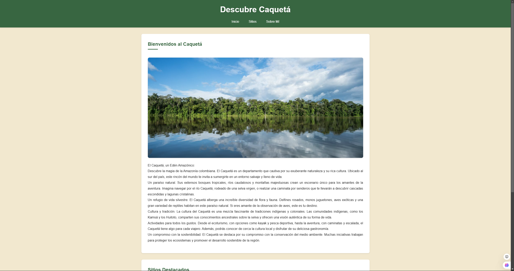
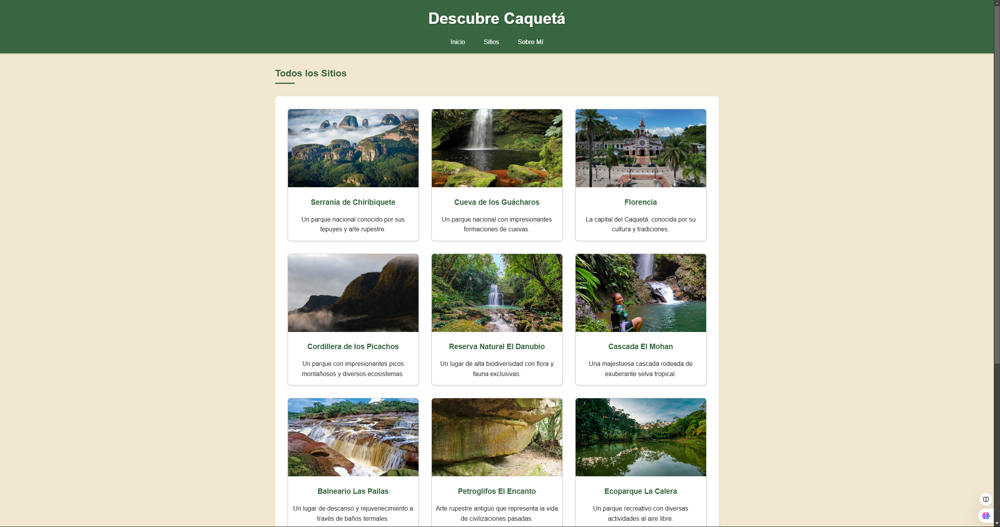
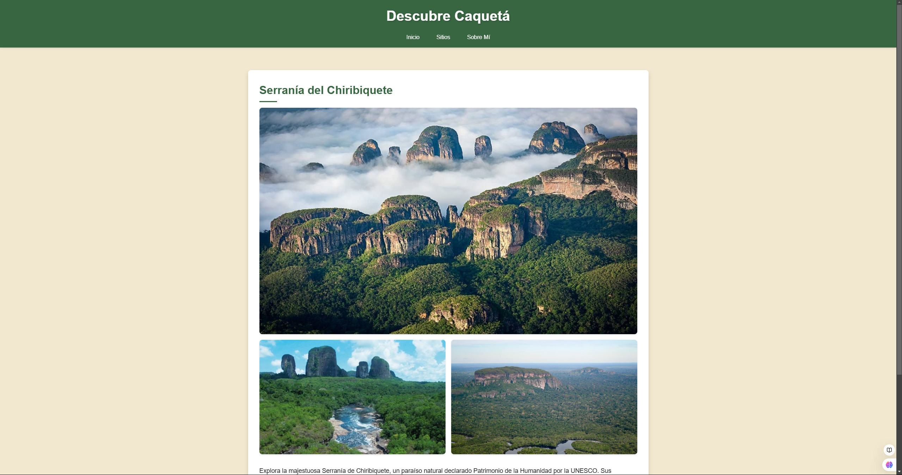
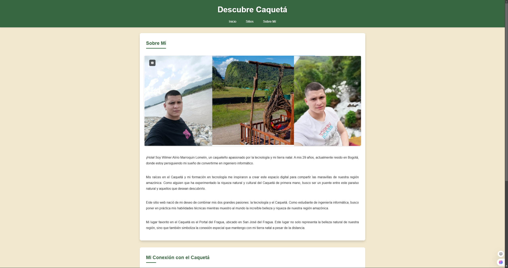

# Descubre Caquetá 🌿

[]()
[]()

## 🌎 Descripción

"Descubre Caquetá" es un proyecto web educativo que busca promover y dar a conocer las maravillas naturales, culturales y turísticas del departamento del Caquetá, Colombia. Como caqueteño y estudiante de Ingeniería Informática, he desarrollado esta plataforma para combinar mis conocimientos tecnológicos con mi pasión por mostrar la riqueza de mi región natal.

## ✨ Características

- **Sitios Turísticos**: Explora 12 destinos imperdibles del Caquetá, incluyendo:
  - Serranía de Chiribiquete (Patrimonio de la Humanidad UNESCO)
  - Cueva de los Guácharos
  - Cascada El Mohan
  - Petroglifos El Encanto
  - Y muchos más...

- **Diseño Responsivo**: Interfaz adaptable a diferentes dispositivos
- **Galería de Imágenes**: Fotografías de alta calidad de los sitios turísticos
- **Información Detallada**: Descripciones completas de cada destino

## 🛠️ Tecnologías Utilizadas

- HTML5
- CSS3
- Diseño Responsivo

## 🚀 Instalación

1. Clona este repositorio:
```bash
git clone https://github.com/WilmerMarroquin/DescubreCaqueta
```

2. Abre el archivo `index.html` en tu navegador preferido

## 📸 Capturas de Pantalla

### 🏠 Página de Inicio

*Vista principal del sitio mostrando los destinos destacados del Caquetá*

### 🗺️ Página de Sitios

*Galería completa de destinos turísticos*

### 🏞️ Detalle de Sitio

*Vista detallada de la Serranía de Chiribiquete*

### 👤 Página Sobre Mí

*Sección personal con información del autor*

---

Para ver el sitio en acción, visita: [https://descubrecaquetawm.onrender.com/](https://descubrecaquetawm.onrender.com/index.html)

## 📋 Estructura del Proyecto

```
DescubreCaqueta/
│
├── index.html
├── sitios.html
├── sobre_mi.html
├── serrania_chiribiquete.html
├── ...
├── css/
│   └── styles.css
├── img/
│   ├── caqueta.jpg
│   ├── serrania_chiribiquete.jpg
│   └── ...
└── 
```

## 🤝 Contribuir

Las contribuciones son bienvenidas. Si tienes sugerencias para mejorar este proyecto:

1. Haz Fork del proyecto
2. Crea una rama para tu característica (`git checkout -b feature/AmazingFeature`)
3. Haz commit de tus cambios (`git commit -m 'Add: nueva característica'`)
4. Haz Push a la rama (`git push origin feature/AmazingFeature`)
5. Abre un Pull Request

## 👤 Autor

**Wilmer Alirio Marroquin Lomelin**
- Estudiante de Ingeniería Informática
- Caqueteño apasionado por la tecnología y su región
- [GitHub](https://github.com/WilmerMarroquin)
- [LinkedIn](https://www.linkedin.com/in/wilmer-alirio-marroquin-lomelin-443231218/)

## 📝 Licencia

Este proyecto está bajo la Licencia MIT - mira el archivo [LICENSE.md](LICENSE.md) para más detalles.

## 🙏 Agradecimientos

- A la Universidad Fundación internacional de a Rioja por el apoyo en el desarrollo de este proyecto
- A todos los caqueteños que compartieron sus conocimientos y experiencias sobre la región
- A la comunidad de desarrolladores por sus valiosos recursos y herramientas

---
Hecho con ❤️ por Wilmer Marroquin | © 2024 Descubre Caquetá